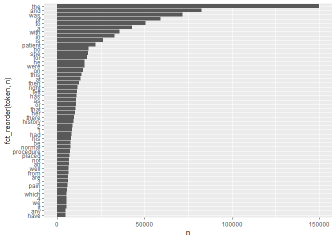
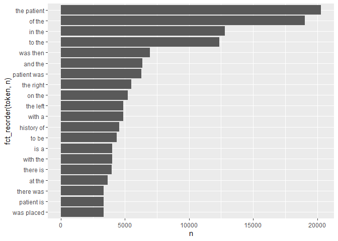
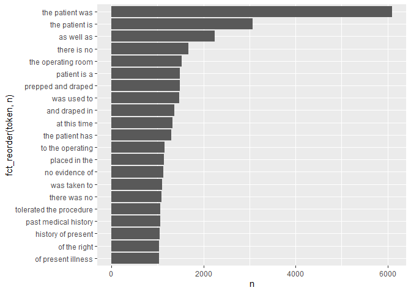

Lab 06 - Text Mining
================
Lin Wang
9/23/2020

# Learning goals

  - Use `unnest_tokens()` and `unnest_ngrams()` to extract tokens and
    ngrams from text.
  - Use dplyr and ggplot2 to analyze text data

# Lab description

For this lab we will be working with a new dataset. The dataset contains
transcription samples from <https://www.mtsamples.com/>. And is loaded
and “fairly” cleaned at
<https://raw.githubusercontent.com/USCbiostats/data-science-data/master/00_mtsamples/mtsamples.csv>.

This markdown document should be rendered using `github_document`
document.

# Setup the Git project and the GitHub repository

1.  Go to your documents (or wherever you are planning to store the
    data) in your computer, and create a folder for this project, for
    example, “PM566-labs”

2.  In that folder, save [this
    template](https://raw.githubusercontent.com/USCbiostats/PM566/master/content/assignment/06-lab.Rmd)
    as “README.Rmd”. This will be the markdown file where all the magic
    will happen.

3.  Go to your GitHub account and create a new repository, hopefully of
    the same name that this folder has, i.e., “PM566-labs”.

4.  Initialize the Git project, add the “README.Rmd” file, and make your
    first commit.

5.  Add the repo you just created on GitHub.com to the list of remotes,
    and push your commit to origin while setting the upstream.

### Setup packages

You should load in `dplyr`, (or `data.table` if you want to work that
way), `ggplot2` and `tidytext`. If you don’t already have `tidytext`
then you can install with

``` r
install.packages("tidytext")
```

### read in Medical Transcriptions

Loading in reference transcription samples from
<https://www.mtsamples.com/>

``` r
library(readr)
library(dplyr)
library(tidyverse)
library(tidytext)
library(ggplot2)
mt_samples <- read_csv("https://raw.githubusercontent.com/USCbiostats/data-science-data/master/00_mtsamples/mtsamples.csv")
mt_samples <- mt_samples %>%
  select(description, medical_specialty, transcription)
head(mt_samples)
```

    ## # A tibble: 6 x 3
    ##   description                  medical_specialty   transcription                
    ##   <chr>                        <chr>               <chr>                        
    ## 1 A 23-year-old white female ~ Allergy / Immunolo~ "SUBJECTIVE:,  This 23-year-~
    ## 2 Consult for laparoscopic ga~ Bariatrics          "PAST MEDICAL HISTORY:, He h~
    ## 3 Consult for laparoscopic ga~ Bariatrics          "HISTORY OF PRESENT ILLNESS:~
    ## 4 2-D M-Mode. Doppler.         Cardiovascular / P~ "2-D M-MODE: , ,1.  Left atr~
    ## 5 2-D Echocardiogram           Cardiovascular / P~ "1.  The left ventricular ca~
    ## 6 Morbid obesity.  Laparoscop~ Bariatrics          "PREOPERATIVE DIAGNOSIS: , M~

-----

## Question 1: What specialties do we have?

We can use `count()` from `dplyr` to figure out how many different
catagories do we have? Are these catagories related? overlapping? evenly
distributed?

``` r
mt_samples %>%
  count(medical_specialty, sort = TRUE)
```

    ## # A tibble: 40 x 2
    ##    medical_specialty                 n
    ##    <chr>                         <int>
    ##  1 Surgery                        1103
    ##  2 Consult - History and Phy.      516
    ##  3 Cardiovascular / Pulmonary      372
    ##  4 Orthopedic                      355
    ##  5 Radiology                       273
    ##  6 General Medicine                259
    ##  7 Gastroenterology                230
    ##  8 Neurology                       223
    ##  9 SOAP / Chart / Progress Notes   166
    ## 10 Obstetrics / Gynecology         160
    ## # ... with 30 more rows

  - ## There are 40 different categories, surgery has the most frequency.

## Question 2

  - Tokenize the the words in the `transcription` column
  - Count the number of times each token appears
  - Visualize the top 20 most frequent words

<!-- end list -->

``` r
library(forcats)
mt_samples %>%
  unnest_tokens(token, transcription) %>%
  count(token, sort = TRUE) %>%
  top_n(50, n) %>%
  ggplot(aes(x = n, y = fct_reorder(token, n)))+
  geom_col()
```

<!-- -->

Explain what we see from this result. Does it makes sense? What insights
(if any) do we get?

  - Basically there are some stop words and number on the top which
    should be removed.

-----

## Question 3

  - Redo visualization but remove stopwords before
  - Bonus points if you remove numbers as well

What do we see know that we have removed stop words? Does it give us a
better idea of what the text is about?

``` r
number_words <- as.character(seq(0,100))

mt_samples %>%
  unnest_tokens(word, transcription) %>%
  filter(!(word %in% tidytext::stop_words$word)) %>%
  filter(!(word %in% number_words)) %>%
  count(word, sort = TRUE) %>%
  top_n(20, n) %>%
  ggplot(aes(x = n, y = fct_reorder(word, n)))+
  geom_col()
```

<!-- -->

  - After removing stop words and numbers, we see patient has the most
    frequency.

-----

# Question 4

repeat question 2, but this time tokenize into bi-grams. how does the
result change if you look at tri-grams?

``` r
mt_samples %>%
  unnest_ngrams(token, transcription, n = 2) %>%
  count(token, sort = TRUE) %>%
  top_n(20, n) %>%
  ggplot(aes(x = n, y = fct_reorder(token, n)))+
  geom_col()
```

<!-- -->

``` r
mt_samples %>%
  unnest_ngrams(token, transcription, n = 3) %>%
  count(token, sort = TRUE) %>%
  top_n(20, n) %>%
  ggplot(aes(x = n, y = fct_reorder(token, n)))+
  geom_col()
```

<!-- -->

-----

# Question 5

Using the results you got from questions 4. Pick a word and count the
words that appears after and before it.

``` r
# pick history to look at
mt_bigrams <- mt_samples %>%
  unnest_ngrams(token, transcription, n = 2) %>%
  separate(token, into = c("word1", "word2"), sep = " ")%>%
  select(word1, word2) 

mt_bigrams %>%
  filter(word1 == "history") %>%
  count(word2, sort = TRUE)
```

    ## # A tibble: 369 x 2
    ##    word2               n
    ##    <chr>           <int>
    ##  1 of               4537
    ##  2 the               761
    ##  3 she               279
    ##  4 he                227
    ##  5 significant       200
    ##  6 this              200
    ##  7 and               197
    ##  8 1                 181
    ##  9 is                172
    ## 10 noncontributory   121
    ## # ... with 359 more rows

``` r
mt_bigrams %>%
  filter(word2 == "history") %>%
  count(word1, sort = TRUE)
```

    ## # A tibble: 567 x 2
    ##    word1        n
    ##    <chr>    <int>
    ##  1 medical   1223
    ##  2 family     941
    ##  3 a          939
    ##  4 social     865
    ##  5 surgical   491
    ##  6 no         473
    ##  7 with       163
    ##  8 any        129
    ##  9 brief      125
    ## 10 the        107
    ## # ... with 557 more rows

``` r
mt_bigrams %>%
  anti_join(tidytext::stop_words, by = c("word1" = "word")) %>%
  anti_join(tidytext::stop_words, by = c("word2" = "word")) %>%
  count(word1, word2, sort = TRUE)
```

    ## # A tibble: 128,013 x 3
    ##    word1         word2           n
    ##    <chr>         <chr>       <int>
    ##  1 0             vicryl       1802
    ##  2 blood         pressure     1265
    ##  3 medical       history      1223
    ##  4 diagnoses     1            1192
    ##  5 preoperative  diagnosis    1176
    ##  6 physical      examination  1156
    ##  7 4             0            1123
    ##  8 vital         signs        1117
    ##  9 past          medical      1113
    ## 10 postoperative diagnosis    1092
    ## # ... with 128,003 more rows

  - The data mostly collected medical, family, social and surgical
    history of patients.

-----

# Question 6

Which words are most used in each of the specialties. you can use
`group_by()` and `top_n()` from `dplyr` to have the calculations be done
within each specialty. Remember to remove stopwords. How about the most
5 used words?

``` r
mt_samples %>%
  unnest_tokens(token, transcription) %>%
  anti_join(tidytext::stop_words, by = c("token" = "word")) %>%
  group_by(medical_specialty) %>%
  count(token, sort = TRUE) %>%
  top_n(1,n)
```

    ## # A tibble: 41 x 3
    ## # Groups:   medical_specialty [40]
    ##    medical_specialty          token       n
    ##    <chr>                      <chr>   <int>
    ##  1 Surgery                    patient  4855
    ##  2 Consult - History and Phy. patient  3046
    ##  3 Orthopedic                 patient  1711
    ##  4 Cardiovascular / Pulmonary left     1550
    ##  5 General Medicine           patient  1356
    ##  6 Gastroenterology           patient   872
    ##  7 Urology                    patient   776
    ##  8 Radiology                  left      701
    ##  9 Emergency Room Reports     patient   685
    ## 10 Discharge Summary          patient   672
    ## # ... with 31 more rows

``` r
mt_samples %>%
  unnest_tokens(token, transcription) %>%
  anti_join(tidytext::stop_words, by = c("token" = "word")) %>%
  group_by(medical_specialty) %>%
  count(token, sort = TRUE) %>%
  top_n(5,n)
```

    ## # A tibble: 209 x 3
    ## # Groups:   medical_specialty [40]
    ##    medical_specialty          token         n
    ##    <chr>                      <chr>     <int>
    ##  1 Surgery                    patient    4855
    ##  2 Surgery                    left       3263
    ##  3 Surgery                    procedure  3243
    ##  4 Consult - History and Phy. patient    3046
    ##  5 Consult - History and Phy. history    2820
    ##  6 Surgery                    0          2094
    ##  7 Surgery                    1          2038
    ##  8 Orthopedic                 patient    1711
    ##  9 Cardiovascular / Pulmonary left       1550
    ## 10 Cardiovascular / Pulmonary patient    1516
    ## # ... with 199 more rows

  - Patient is the most used word in each medical specialty.
  - When we look at top 5 used words in each specialty, we could see
    patient, left, procedure, history are the most used words in its
    specialty.

# Question 7 - extra

Find your own insight in the data:

Ideas:

  - Interesting ngrams
  - See if certain words are used more in some specialties than others

<!-- end list -->

``` r
mt_bigrams_unitted <- mt_samples %>%
  unnest_ngrams(token, transcription, n = 2) %>%
  separate(token, into = c("word1", "word2"), sep = " ") %>%
  anti_join(tidytext::stop_words, by = c("word1" = "word")) %>%
  anti_join(tidytext::stop_words, by = c("word2" = "word")) %>%
  unite(bigram, word1, word2, sep = " ")

mt_bigrams_unitted %>%
  count(medical_specialty, bigram) %>%
  bind_tf_idf(bigram, medical_specialty, n) %>%
  arrange(desc(tf_idf)) %>%
  top_n(20,n)
```

    ## # A tibble: 20 x 6
    ##    medical_specialty         bigram                     n      tf    idf  tf_idf
    ##    <chr>                     <chr>                  <int>   <dbl>  <dbl>   <dbl>
    ##  1 Surgery                   0 vicryl                 843 0.00638 0.644  4.11e-3
    ##  2 Cardiovascular / Pulmona~ coronary artery          414 0.00812 0.470  3.82e-3
    ##  3 Surgery                   4 0                      528 0.00399 0.644  2.57e-3
    ##  4 Surgery                   preoperative diagnosis   555 0.00420 0.598  2.51e-3
    ##  5 Surgery                   postoperative diagnos~   518 0.00392 0.598  2.34e-3
    ##  6 Surgery                   3 0                      425 0.00321 0.644  2.07e-3
    ##  7 Surgery                   2 0                      353 0.00267 0.644  1.72e-3
    ##  8 Surgery                   sterile fashion          334 0.00253 0.598  1.51e-3
    ##  9 Surgery                   blood loss               439 0.00332 0.431  1.43e-3
    ## 10 Surgery                   estimated blood          353 0.00267 0.511  1.36e-3
    ## 11 Surgery                   patient tolerated        449 0.00340 0.393  1.33e-3
    ## 12 Surgery                   stable condition         370 0.00280 0.357  9.98e-4
    ## 13 Surgery                   diagnoses 1              428 0.00324 0.288  9.31e-4
    ## 14 Consult - History and Ph~ family history           332 0.00401 0.223  8.96e-4
    ## 15 Surgery                   supine position          349 0.00264 0.322  8.49e-4
    ## 16 Consult - History and Ph~ physical examination     338 0.00409 0.163  6.64e-4
    ## 17 Consult - History and Ph~ social history           320 0.00387 0.163  6.29e-4
    ## 18 Consult - History and Ph~ past medical             380 0.00459 0.134  6.13e-4
    ## 19 Consult - History and Ph~ medical history          415 0.00502 0.0780 3.91e-4
    ## 20 Consult - History and Ph~ blood pressure           306 0.00370 0.105  3.90e-4

  - We could see coronary artery is the most relevant term under
    Cardiovascular / Pulmonary, and preoperative/postoperative diagnosis
    is the most relevant term under Surgery.
